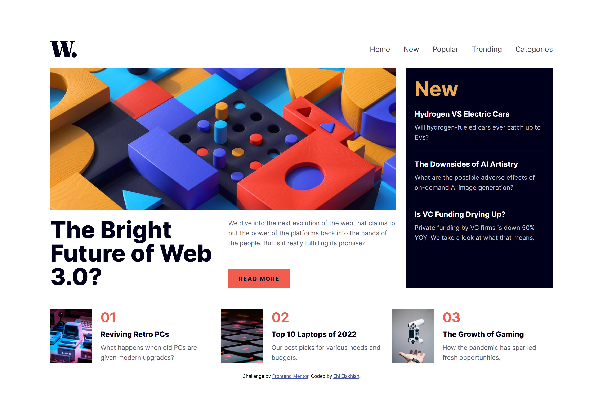
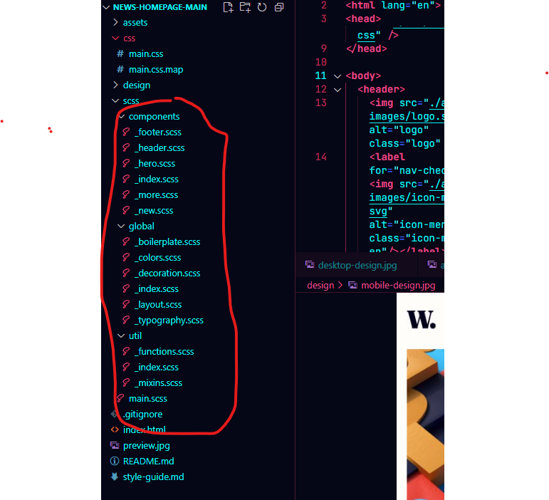

# Frontend Mentor - News homepage solution

This is my solution to the [News homepage challenge on Frontend Mentor](https://www.frontendmentor.io/challenges/news-homepage-H6SWTa1MFl). Frontend Mentor challenges help you improve your coding skills by building realistic projects. 

## Table of contents
- [Me](#meet-me)
- [Overview](#overview)
  - [The challenge](#the-challenge)
  - [Screenshot](#screenshot)
  - [Links](#links)
- [My process](#my-process)
  - [Built with](#built-with)
  - [What I learned](#what-i-learned)
  - [Continued development](#continued-development)
  - [Useful resources](#useful-resources)
- [Acknowledgments](#acknowledgments)
- [Author](#author)
- [Thanks](#thanks)

## Meet Me
Good day. I'm Ehi. I'm an aspiring developer from Edo, Nigeria. I took this challenge. Here's how I did it and thanks for reading!

## Overview

### The challenge

Users should be able to:

- View the optimal layout for the interface depending on their device's screen size
- See hover and focus states for all interactive elements on the page

### Screenshot



I know, It doesn't match it very much, or even at all. I gave it my all though.


### Links
- Solution URL: [My Solution](https://github.com/Ehiejakhian/Frontend-Mentor-News-homepage)
- Live Site URL: [Live Site](https://ehiejakhian.github.io/Frontend-Mentor-News-homepage)

## My process
I started this one by opening the design images in GIMP (GNU Image Manipulation Program). I measure the paddings, gutters (gaps) and sizes of responsive elements. These help me create responsive functions and mixins. Then, I write my HTML, and give class names using BEM which I recently learned. I use SCSS to create my styling so BEM makes it easier.

After my HTML, I start styling with padding. I set the margin of all elements to zero and then give all elements borders. This helps me visualize all element boundaries - all this I do without adding any color.

Then, I add color, backgrounds and border radii to the assigned elements. I prefer using Comic Sans MS and or Outfit as my font because they feel relaxing to my eyes and help me think better. I can't explain it though, it's just a feeling.

Weird, right?😁

After that, I modularize my "sassy sheets" and them link them all to a single file to be compiled. I learnt this from Jessie Chan's (Coder Coder on Youtube) video on how to organise SCSS files into files to be more effective and simple. Here's how I modularized this one.


### Built with

- Semantic HTML5 markup
- CSS custom properties
- Flexbox
- CSS Grid
- Mobile-first workflow
- **No Javascript**

### What I learned

The mobile navigation without JavaScript was awesome. I learned how to do it from **Coding2Go** on YouTube. He's really good at explaining front-end stuff.

Here's the HTML. The labels all target the single input element. One for the hamburger, one for the close-icon, and one for the semi-transparent-opacified layer that appers when the navigation is open in mobile. Try the site to see what I mean. Its so good to be able to do this with CSS and it is responsive and animatable.

```html
<header>
  
  <label for="nav-checkbox"></label>
  <input type="checkbox" id="nav-checkbox" />
  <label for="nav-checkbox" class="overlay"></label>
  <nav>
    <label for="nav-checkbox"></label>
    <ul>
      <li><a href="#">Home</a></li>
      <li><a href="#">New</a></li>
      <li><a href="#">Popular</a></li>
      <li><a href="#">Trending</a></li>
      <li><a href="#">Categories</a></li>
    </ul>
  </nav>
</header>
```

```scss
header {
  @include m.df(space-between, center);
  
  input {
    display: none;
  }
  img.logo, .icon-menu-open {
    width: auto;
  }
  img.logo {
    width: clamp(3rem, 5dvw, 4rem);
  }
  nav {
    transition: all .75s;
    padding: 20px;
    @include m.df(normal, normal, column, 70px);
    position: fixed;
    top: 0;
    bottom: 0;
    right: -100%;
    width: 60dvw;
    background-color: #fff;
    z-index: 10;
  
    label {
      @include m.df(right, center);
      & img {
        width: auto;
        align-self: flex-end;
      }
    }

    ul {
      @include m.df(normal, start, column, 20px);
      list-style: none;
      li {
        a {
          text-decoration: none;
          color: c.$very-dark-blue;
          font-size: 18px;
        }
      }
    }
  
  }
  input:checked ~ nav{
    right: 0;
  }
  .overlay {
    position: fixed;
    right: -100%;
    transition: all .75s;
  }
  input:checked ~ .overlay {
    z-index: 9;
    position: fixed;
    top: 0;
    width: 100dvw;
    bottom: 0;
    left: 0;
    right: 0;
    background: rgba(0,0,0,.3);
  }


  @media (min-width: l.$tab) {
    input, label, .overlay {
      display: none;
    }
    nav {
      position: static;
      padding: 0;
      gap: 0;
      & label {
        display:none;
      }
      & ul {
        @include m.df(right, start,  row, 2rem);
        li {
          a {
            color: c.$grayish-blue;
            font-size: 1rem;
            transition: all .3s;
            &:hover {
              color: c.$soft-red;
            }
          }
        }
      }
    }
  }
}
```
**Yep. NO JavaScript**. This is definitely an upgrade for me.


### Continued development

It looked like every element in the desktop design snaps to a certain defined position in a grid defined for it. I already tried that approach to the extent I use subgrid to make clild elements inherit their parent's grid properties but it broke my design and my heart.💔

I would love to get this design perfect one day. Any help with this please chat me up or just reply to my solution.

### Useful resources

- [Jessie Chan's "How I organise my SASS projects"](https://www.youtube.com/watch?v=LQsjNmkqUOc&list=PPSV) - This helped me creat a quite wonderful folder structure. I really liked this pattern and will use it going forward.
- [Coding2Go's "Create a Responsize navbar - a CSS only solution"](https://youtu.be/8eFeIFKAKHw?si=GzljC16g9cEAOXLY) - This is an amazing video that I'll recommend to all out there who want to use only CSS to create nav-bars and make their lives simpler.

## Acknowledgments

I want to thank everyone out there who takes their time to put out useful coding tips and info out on the web for all to use for free and paid. Thank you. For those of us from otherwise poor vicinities, you help make our dreams come true.

## Author
Let's gist!
- Website portfiolo - [Ehi Ejakhian](https://ehiejakhian.github.io/)
- Frontend Mentor - [@EhiEjakhian](https://www.frontendmentor.io/profile/EhiEjakhian)
- Chat me on Whatsapp - [Ehi Ejakhian](https://wa.me/+2348142340182?text=Hello%20Ehi%20.%20I%20checked%20your%20News%20Homepage%20solution)
- LinkedIn - [Ejakhian Ehi](https://ng.linkedin.com/in/ehi-ejakhian-2302a7318)

I'm also an aspiring comic and sketch artist, so if you have any gigs or if you can relate, check me up on whatsapp and see my art.

# Thanks!
Thank you for going through this. I really hope I did good to your taste, if not please tell me how to improve on the comments section of my solution. Thanks again!
